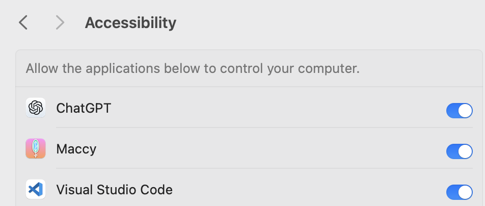

# Assist in locating the enemy in Roblox Rivals

## collect screenshots

## let AI learn from the screenshots
roboflow

## run the model to infer
### online
too slow

### local
quick

## move mouse by coordinate
need set mac accessibility 
1.	Go to System Preferences > Security & Privacy > Privacy.
2.	Select the Accessibility section.
3.	Add the terminal or IDE you are using to run your script (e.g., Terminal, PyCharm, VS Code).

## assist in game 
once the programs is started
- program starts to record screen
- program sends the screen to the model 
- program receives the coordinate from the model
- program move the mouse to the coordinate (this does not work in roblox, first person view)

## blocked, mouse move not working in roblox
thought: can I send mouse move bluetooth signals from my machine and also received by my machine?

##